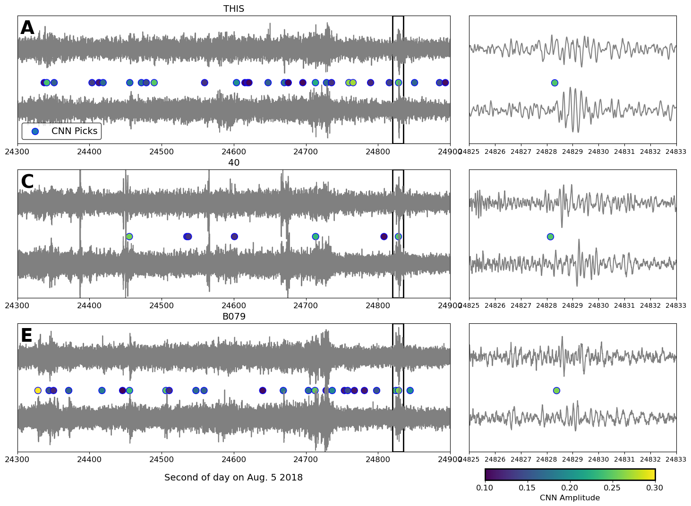

# Parkfield-LFE-CNN

## Description

This repository contains many variations of a U-shaped Convolutional Neural Network trained to detect low-frequency earthquakes on the San Andreas fault.  The full descrition of the model, training data, and performance can be found in:

Thomas, A. M., A. Inbal, J. Searcy, D. R. Shelly, and R. Burgmann (2021) Identification of low-frequency earthquakes on the San Andreas fault with deep learning. Submitted to Geophysical Research Letters.

BibTeX:

    @article{thomas2021lfe,
        title={Identification of low-frequency earthquakes on the San Andreas fault with deep learning},
        author={Thomas, Amanda M and Inbal, Asaf, and Searcy, Jacob and Shelly, David R and B{\"u}rgmann, R},
        journal={Geophysical Research Letters},
	pages={e2021GL093157},
        publisher={Wiley Online Library}
    }

## Requirements

In order to run the scripts you will need both [Obspy](https://docs.obspy.org/) (I have version 1.2.2) and [Tensorflow](https://www.tensorflow.org/) (I have version 1.14.0).  I recommend creating a [conda](https://docs.conda.io/en/latest/) environment and installing both packages into it.    

## Make LFE detections

To make detections with the CNN, the script you will need is **apply\_cnn.py**. The options you can set within the script are:

* --drop [1 or 0], include (1) or omit (0) drop layer in the network architecture 
* --large [0.5, 1, 2,or 4], the model size
* --std [0.05, 0.1, 0.2, and 0.4], the standard deviation of the target gaussian in seconds 
* --plots [1 or 0], make plots (1) or do not make plots (0)

You can change these options to select which model version you'd like.  You need to choose from the paper your desired target gaussian standard deviation (std=0.05, 0.1, 0.2, or 0.4 seconds), your model size (fac=0.5, 1, or 2), whether you want a drop layer or not (drop=0 or 1).  If you just want me to pick the best one for you do nothing; I've already set the scripts up to use my preferred model.    This script loads the data, processes it (e.g. filters and decimates/interpolates to 100 Hz) and runs the detector on 15 s windows that are not overlapping (i.e. shift=15).  It registers any detections that exceed a decision threshold of 0.1 (thresh=0.1).  If you want to make some plots of the windows and CNN output you can set plots=1.  This writes out a pickle file called 'picks_[drop]-[large]-[std]-[station]-[year]-[month]-[day].pkl'.

The second script, **figure4.py**, makes Figure 4 from the paper.  I have included detection files made by **apply\_cnn.py** and data from the three stations shown in the manuscript.    

